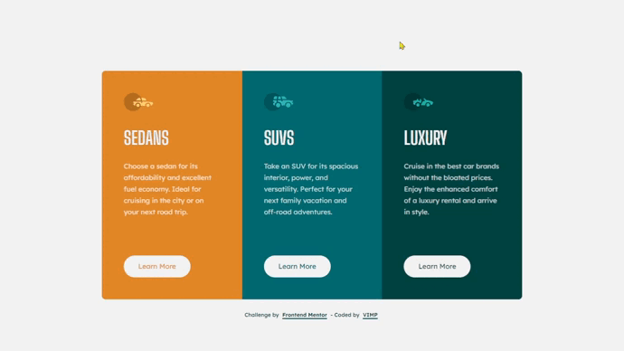

# Frontend Mentor - 3-column preview card component solution

This is a solution to the [3-column preview card component challenge on Frontend Mentor](https://www.frontendmentor.io/challenges/3column-preview-card-component-pH92eAR2-).

Frontend Mentor challenges help you improve your coding skills by building realistic projects.

## Table of contents

🔳 [The challenge](#the-challenge-nerd_face)

🔳 [Screenshot](#screenshot-camera)

🔳 [Links](#links-link)

🔳 [Built with](#built-with-hammer_and_pick)

🔳 [Author](#author-beginner)

## *The challenge* :nerd_face:

Users should be able to:

🎯 View the optimal layout depending on their device's screen size.

🎯 See hover states for interactive elements.

## *Screenshot* :camera:

## *Links* :link:

[Live Site URL](https://mendezpvi.github.io/fm-3-column-preview-card/) 👀

[Solution in Frontend Mentor](https://www.frontendmentor.io/solutions/3-column-preview-card-using-css-grid-HEmrg94zdp) 👀

[Challenges overcome](https://github.com/mendezpvi/frontend-mentor-challenges) 👀

## *Built with* :hammer_and_pick:

✅ Semantic HTML5 markup

✅ CSS custom properties

✅ Flexbox

✅ CSS Grid

✅ Mobile-first workflow

## *Author* :beginner:

✨ Frontend Mentor - [@mendezpvi](https://www.frontendmentor.io/profile/mendezpvi)
